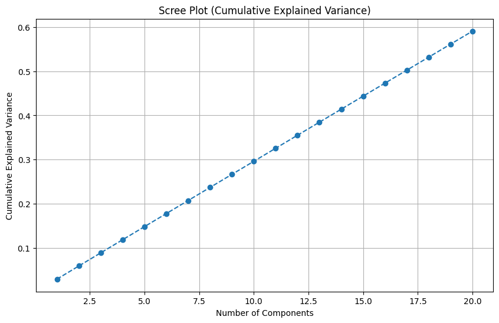
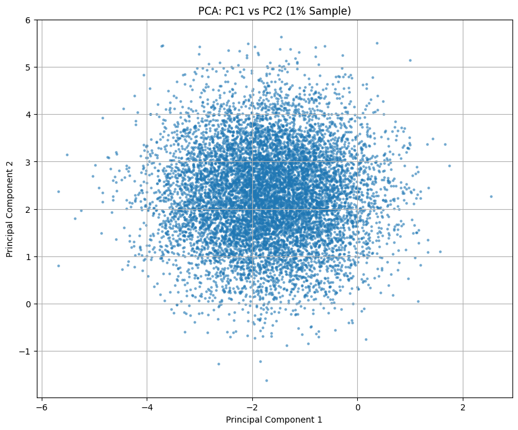
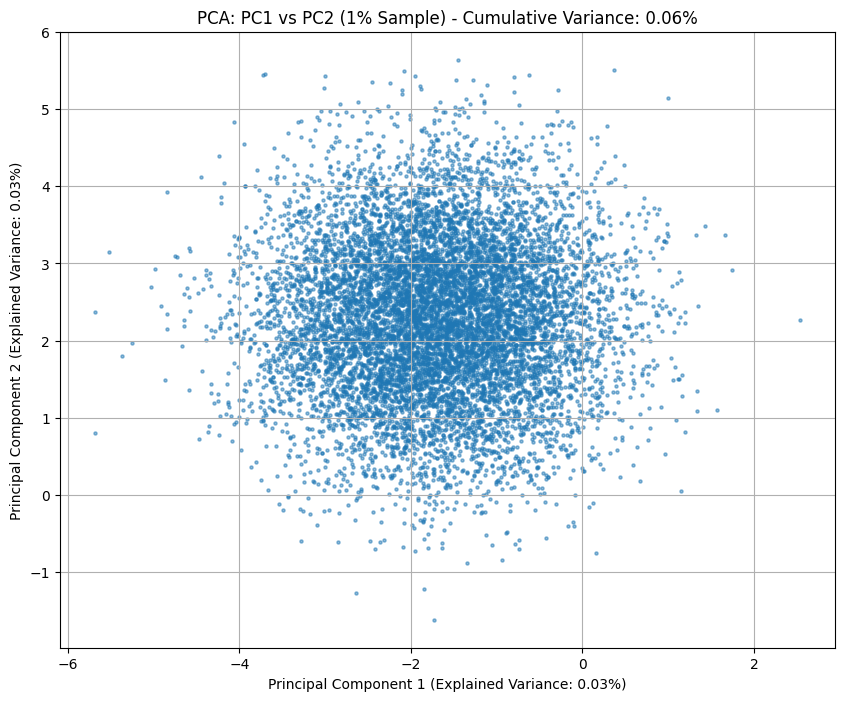
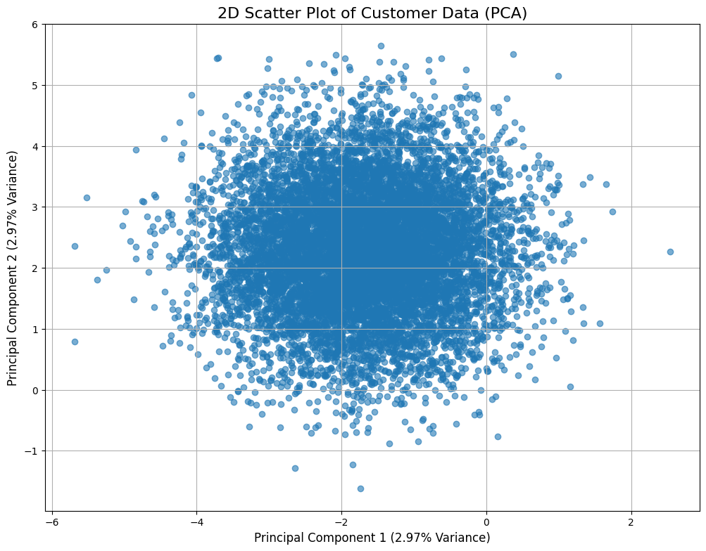

# 📈 PCA Analysis — Feature Reduction & Visualization

**Notebook:** `Bigdata.ipynb`

## Summary
This document presents Principal Component Analysis (PCA) visualizations generated from the dataset.  
PCA helps reduce dimensionality while preserving the maximum possible variance.  
The following figures illustrate 2D PCA projections and the cumulative variance explained by principal components.

---

## 📁 Figures  
Place the images in your repository under:

```
figures/pca/fg1.png
figures/pca/fg2.png
figures/pca/fg3.png
figures/pca/fg4.png
```

---

## 🔵 1. 2D Scatter Plot of Customer Data (PCA)
Projection of the dataset onto the first two principal components.



---

## 🔵 2. PCA — PC1 vs PC2 (1% Sample) with Explained Variance
Shows explained variance captured by PC1 and PC2 individually.



---

## 🔵 3. PCA — PC1 vs PC2 (1% Sample)
A clean scatter plot of a 1% sampled dataset.



---

## 🔵 4. Scree Plot — Cumulative Explained Variance
Displays the cumulative variance explained by the first 20 principal components.



---

## Notes
- PCA is useful for visualizing high‑dimensional data in 2D.  
- Sampling helps reduce noise and computational cost.  
- Replace/update images anytime; keep the same filenames for working README links.

---

## Download
This README file is available below.

